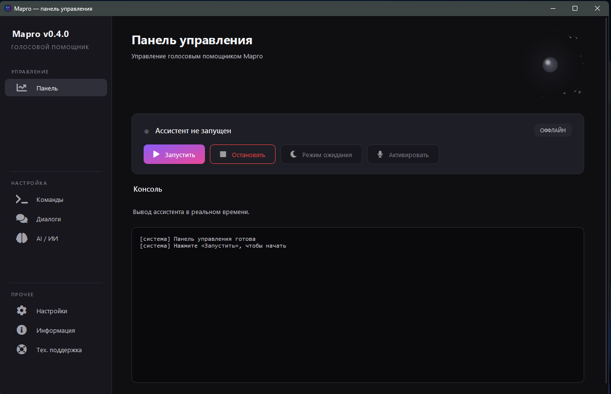

# Марго

**Локальный голосовой помощник для Windows**

[📖 Документация](https://margo-voice-assistant.gitbook.io/margo)

---

## ✨ О проекте

**Марго** — голосовой помощник, который работает **полностью локально** на вашем компьютере. 
Никаких облаков, никаких запросов в интернет, никакой подписки.

Всё, что вы говорите, **остаётся у вас**.

### 🎯 Возможности

- 🎤 **Распознавание речи** — Vosk (офлайн)
- 🔊 **Синтез речи** — Silero TTS (5 голосов на выбор)
- ⚙️ **Гибкие настройки** — имя, голос, модель, микрофон, поведение.
- 🧩 **Кастомные команды и диалоги** — создавайте свои через UI
- 🎯 **Работает офлайн** — интернет нужен только для обновлений и работы с поисковиком.

---

## 🚀 Установка (СКОРО)

**КАК СКАЧАТЬ ?**
1. [Перейти по ссылке в Google Disk](https://drive.google.com/file/d/1egusrGdxx1HmWsVqLv-tYFNwhH2pXWt9/view?usp=sharing)
2. Скачать .zip архив.
3. Распаковать .zip архив в любую удобную дирректорию.
4. Открыв в распакованной папке Assistant.exe первое открытие займёт около 4-5 секунд. 
В директории дополнительно будут созданы необходимые файлы.
5. Открыв программу в Панели управления ассистентом - нажимаете на кнопку "Запустить". Система установит автоматически все необходимые библиотеки для работы системы. Также может потребоваться использование VPN для установки.

---

## 📖 Как пользоваться

### Активация

Скажите **«Марго»** — ассистент ответит «Слушаю» и будет ждать команду **25 секунд**.

> 💡 **Не нужно говорить «Марго» перед каждой командой.** 
> После первого «Марго» — 25 секунд активного режима.

### Свои команды

Откройте **Настройки → Команды** или **Настройки → Диалоги** и создайте 
**свои** — с любыми триггерами и действиями.

Системные команды расписаны в Документации.
---

## 🎨 Внешний вид

- **Счётчики команд и диалогов** — видно, сколько создано
- **Запуск с Windows** — Удобно, так ещё и можно настроить автоматическое включение помощника
- **Трей** — сворачивание в системный трей

---

## 🛠️ Разработка

### Стек

- **Python 3.10+**
- **PySide6** — UI
- **Vosk** — распознавание речи
- **Silero TTS** — синтез речи
- **SQLite** — хранение команд и настроек

## 🔒 Приватность

- ✅ **Все вычисления — локально.**
- ✅ **Никакие данные не уходят в интернет.**
- ✅ **Распознавание и синтез — офлайн.**
- ✅ **Интернет нужен только** для проверки обновлений и открытия сайтов.

---

## 🤝 Обратная связь

- 💬 **Telegram-канал:** [@qodishq](https://t.me/qodishq)

---

**Сделано с ❤️ для тех, кто ценит приватность**

⭐ Если проект полезен — поставьте звезду!

